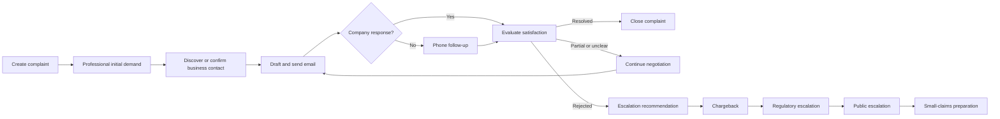

# Complaint Warrior

**Complaint Warrior** is a human-supervised, AI-assisted system for managing consumer disputes from the initial complaint through negotiation, phone follow-up, chargeback, regulatory escalation, public escalation, and California small-claims preparation.

The project combines a Streamlit interface, Gmail integration, automated phone calls, evidence management, business-contact discovery, and SQLite-backed case tracking. The system is designed to keep the user in control of consequential actions such as sending messages, placing calls, filing disputes, and submitting court documents.

> **Important:** Complaint Warrior is an experimental research and workflow-support system. It does not provide legal advice, represent users in court, guarantee a refund, or guarantee that a filing will be accepted.

---

## Main capabilities

- Create and manage consumer complaints.
- Rewrite an informal complaint into a professional demand.
- Extract the requested remedy and resolution strategy.
- Draft follow-up emails using the complaint and communication history.
- Send email through the user's connected Gmail account.
- Detect and process company replies.
- Classify a response as resolved, rejected, partial, or unclear.
- Schedule phone follow-up after unanswered email.
- Call the company and capture the response transcript.
- Discover missing business email, phone, and website information.
- Preserve user-entered business contacts as authoritative.
- Share verified business contacts across Complaint Warrior modules.
- Upload receipts, screenshots, contracts, and other evidence.
- Generate an evidence-summary PDF.
- Track chargeback, regulatory, social-media, and court escalation.
- Generate California small-claims packets and EFSP-ready filing bundles.
- Delete unwanted complaints with an explicit permanent-deletion confirmation.

---

## Workflow



Complaint-wide milestones currently include:

- `resolved`
- `social_network_shared`
- `charge_back_initiated`
- `submitted_to_small_claim_court`
- `escalated_to_authorities`

A resolved complaint and a complaint submitted to small-claims court pause ordinary automated negotiation. Regulatory escalation pauses further action until a later inbound response is recorded.

---

## Interface behavior

### 1. Initial demand

The left-side form operates in two modes.

#### Create a new complaint

Click **Create new complaint** to clear and initialize the form. Enter:

- User name
- Company name
- Company/business email
- Company phone
- Company website
- Subject
- Complaint description
- Communication policy

Click **Add complaint** to save the complaint and select it.

#### Load an existing complaint

Selecting an entry such as:

```text
CMP-20260702-132250 — Unfair toll activation charge
```

loads the complaint into the Initial demand section. Stored or discovered business contact values are displayed with the complaint.

Uploads are disabled while an unsaved new complaint is being prepared, preventing evidence from being attached to the previously selected case.

### 2. Resolution strategy and current status

The selected complaint displays:

- Primary resolution goal
- Current status
- Final conclusion
- Module milestones
- Resolution strategy details
- Thread/lane state
- Recommended next action

### Complaint deletion

The complaint selector includes a guarded **Delete** action. Permanent deletion requires a second confirmation and removes complaint-scoped database records, including compatible phone-result and small-claims records. Gmail messages and local evidence files are retained to avoid unintentionally destroying external records.

---

## Business-contact discovery

Complaint Warrior uses action-specific contact resolution.

### User-entered values are authoritative

A user-specified email, phone, or website is not overwritten by automatic discovery.

- **Draft next message** does not search for an email when a business email is already stored.
- **Send selected drafts** does not search for an email when a business email is already stored.
- **Call company now** does not search for a phone when a business phone is already stored.
- Discovery fills blank fields only.

When a contact is discovered, it is written to the complaint and appears in:

- **Company / business email**
- **Company phone**
- **Company website**

The user can review or correct these values before the next action.

### Discovery sequence

When a required contact is missing, the manager checks:

1. Contact values already saved in the complaint.
2. The original complaint and actual communication history.
3. The shared `business_contacts` table.
4. Existing `subscribed_companies` contact data.
5. A website inferred from a known business email domain.
6. Google Places Text Search when configured.
7. An optional private contact-resolution endpoint.
8. Public `mailto:` and `tel:` links on the official website and a limited set of contact/support pages.

The user's own email and common personal-email domains are excluded from business-email inference.

### Shared business directory

Discovered or user-confirmed contacts are stored in `cw_companies.sqlite` so they can be reused by other complaints and Warrior modules.

```text
business_contacts
├── normalized company key
├── company name
├── email
├── phone
├── website
├── confidence
├── source history
├── verification timestamp
└── last-used timestamp
```

This table is separate from `subscribed_companies`. Discovering a contact does not make a business a subscribed company.

---

## Email behavior

Complaint Warrior connects to Gmail using OAuth tokens stored in SQLite.

Supported operations include:

- Drafting a message from the complaint state
- Sending selected drafts
- Reading replies in the associated Gmail thread
- Applying a processed label
- Combining email and phone history for the next decision

### Production safety

Production detection is intentionally strict.

- `CW_DEPLOY_ENV=prod` enables sends to the real business address.
- Development and debug modes redirect outbound mail to the configured test inbox.
- `CW_FORCE_TEST_INBOX=1` forces safe redirection even in a production-named directory.

When no usable business email can be found, production sending is blocked. The UI explains that the user can enter an email manually or allow Complaint Warrior to search the complaint, communication history, shared directory, known website/domain, and configured lookup providers.

---

## Phone behavior

The phone module can:

- Determine when phone follow-up is due after unanswered email.
- Limit automatic attempts for a given sent message.
- Place a call through the configured call provider.
- Store the returned transcript.
- Re-evaluate the complaint after the call.

### Direct-number safety

The selected stored phone number must be passed directly to the call layer. When a user supplied the number, automatic routing must not replace it.

Before a call, Complaint Warrior records an activity similar to:

```text
Phone call initiated
Calling Example Company at +12095551212.
```

The activity metadata includes the target number and its source. The call is blocked if the call agent cannot accept the selected direct number safely.

---

## Small Claim Court Warrior

The California small-claims extension can:

- Load eligible Complaint Warrior cases from SQLite.
- Prepare an SC-100-oriented case packet.
- Generate damages, timeline, and exhibit tables.
- Fill an uploaded or official SC-100 PDF on a best-effort basis.
- Validate PDF integrity, encryption, form fields, size, and searchability.
- Flatten the final filing PDF.
- Build an EFSP-ready ZIP with a filing manifest and SHA-256 hashes.
- Track e-filing status, envelope number, court case number, receipt, and rejection reason.
- Update Complaint Warrior only after actual submission is confirmed.

The assisted e-filing flow supports a conservative allow-list of California counties whose public materials identify small claims as electronically fileable. Availability must still be checked at submission time because a court may exclude a specific filing type or filing code.

Electronic filing normally requires an approved Electronic Filing Service Provider. The project supports:

1. A configured enterprise/private EFSP API.
2. Human-assisted upload through an approved provider portal.
3. Mail or in-person fallback when e-filing is unavailable.

Court filing and service of process are separate steps.

---

## Representative project structure

The exact repository layout may evolve, but the core deployment typically contains:

```text
complain_warrior/
├── cw_app_phone.py                    # Main Streamlit interface
├── complaint_manager_phone.py         # Complaint workflow and contact logic
├── text_processor.py                  # LLM/rule-based text and decision processing
├── storage.py                         # Complaint and call-result SQLite stores
├── call.py                            # Phone-agent/Twilio integration
├── gmail_oauth_server.py              # Gmail OAuth callback service
├── gmail_token_store.py               # Gmail token persistence
├── small_claim_court_warrior.py       # California court-packet application
├── charge_back_initiator/             # Optional chargeback module
├── cw_regulatory/                     # Optional regulatory module
├── cw_uploads/                        # User-uploaded evidence
├── cw_store.sqlite                    # Complaint state database
├── cw_companies.sqlite                # Shared company/contact database
├── cw_gmail_tokens.sqlite             # Gmail OAuth token database
├── requirements.txt
└── README.md
```

---

## Requirements

- Python 3.9 or newer
- Streamlit
- SQLite
- `requests`
- Google API client and OAuth libraries
- ReportLab
- `pypdf`
- `pandas`
- Twilio or the phone provider expected by `call.py`
- Access to the configured LLM provider when AI-assisted text processing is enabled

The application has been kept compatible with Python 3.9. Use `Optional[str]`, rather than `str | None`, when adding annotations that must run on Python 3.9.

---

## Quick start

### 1. Clone the repository

```bash
git clone https://github.com/bgalitsky/complain_warrior.git
cd complain_warrior
```

### 2. Create a virtual environment

```bash
python3 -m venv .venv
source .venv/bin/activate
python -m pip install --upgrade pip
```

On Windows:

```powershell
py -m venv .venv
.venv\Scripts\activate
python -m pip install --upgrade pip
```

### 3. Install dependencies

```bash
pip install -r requirements.txt
```

At minimum, the small-claims module requires:

```text
streamlit>=1.41
pandas>=2.2
requests>=2.31
pypdf>=5.0
reportlab>=4.2
```

The primary application additionally requires the Google/Gmail, phone-provider, and LLM dependencies imported by its modules.

### 4. Configure environment variables

Create a local shell configuration or service environment. Never commit real secrets.

```bash
export CW_DB_PATH="$PWD/cw_store.sqlite"
export CW_COMPANIES_DB="$PWD/cw_companies.sqlite"
export CW_SUBSCRIPTIONS_DB="$PWD/cw_companies.sqlite"
export GMAIL_TOKEN_DB="$PWD/cw_gmail_tokens.sqlite"

export CW_DEPLOY_ENV="dev"
export CW_FORCE_TEST_INBOX="1"
export PUBLIC_BASE="https://your-public-host.example"

# Optional business discovery
export CW_GOOGLE_PLACES_API_KEY=""
export CW_CONTACT_LOOKUP_API_URL=""
export CW_CONTACT_LOOKUP_API_TOKEN=""

# Optional external modules
export CW_CHARGE_BACK_APP_URL="/charge_back_initiator/"
export CW_REGULATORY_APP_URL="/cw_regulatory/"
export CW_SMALL_CLAIMS_APP_URL="/small_claim_court_warrior/"
export CW_SOCIAL_SHARE_URL=""

# Optional EFSP gateway
export CW_EFSP_API_URL=""
export CW_EFSP_API_TOKEN=""
export CW_EFSP_PROVIDER_NAME="Configured EFSP API"
```

Configure the credentials expected by `text_processor.py`, `call.py`, and the Gmail OAuth service separately. Common deployments may require variables such as an LLM API key and phone-provider credentials.

### 5. Start Gmail OAuth

Run the OAuth callback service used by your deployment, for example:

```bash
python gmail_oauth_server.py
```

Set `PUBLIC_BASE` to the externally reachable base URL. The Streamlit sidebar uses:

```text
${PUBLIC_BASE}/auth/start
```

for the Gmail connection flow.

### 6. Start Complaint Warrior

```bash
streamlit run cw_app_phone.py
```

For a server deployment:

```bash
streamlit run cw_app_phone.py \
  --server.address 0.0.0.0 \
  --server.port 8501
```

### 7. Start Small Claim Court Warrior

```bash
streamlit run small_claim_court_warrior.py \
  --server.address 0.0.0.0 \
  --server.port 8502
```

---

## Important environment variables

| Variable | Purpose | Default |
|---|---|---|
| `CW_DB_PATH` | Complaint and call-result database | `cw_store.sqlite` |
| `CW_COMPANIES_DB` | Shared business-contact database | `cw_companies.sqlite` |
| `CW_SUBSCRIPTIONS_DB` | Subscription database; can share the company DB | `cw_companies.sqlite` |
| `GMAIL_TOKEN_DB` | Gmail OAuth token database | `cw_gmail_tokens.sqlite` |
| `PUBLIC_BASE` | Public base URL for OAuth links | Empty |
| `CW_AUTH_GUIDE_URL` | Gmail setup guide | `${PUBLIC_BASE}/downloads/Gmail%20Authentication.pdf` |
| `CW_DEPLOY_ENV` | `prod`, `dev`, `development`, `test`, or `debug` | Directory-based detection |
| `CW_FORCE_TEST_INBOX` | Force safe email redirection | Disabled |
| `CW_PROD_DIR_NAME` | Directory name treated as production | `prod` |
| `CW_LOGO_PATH` | Logo displayed by Streamlit | `complaint_warrior.png` |
| `CW_GOOGLE_PLACES_API_KEY` | Optional business phone/website discovery | Empty |
| `CW_CONTACT_LOOKUP_API_URL` | Optional private contact resolver | Empty |
| `CW_CONTACT_LOOKUP_API_TOKEN` | Bearer token for private resolver | Empty |
| `CW_CONTACT_LOOKUP_TTL_HOURS` | Lookup cache period | `24` |
| `CW_CONTACT_HTTP_TIMEOUT` | Public lookup timeout in seconds | `12` |
| `CW_CONTACT_MAX_HTML_BYTES` | Maximum downloaded HTML per page | `2000000` |
| `CW_EFSP_API_URL` | Optional filing gateway | Empty |
| `CW_EFSP_API_TOKEN` | Filing gateway bearer token | Empty |
| `CW_EFSP_PROVIDER_NAME` | Display name of filing gateway | `Configured EFSP API` |

---

## Database model

### `cw_store.sqlite`

The main database stores complaint ownership and serialized complaint state. Depending on enabled modules, it can also contain:

- `complaints`
- `call_results`
- `small_claim_packets`
- `small_claim_efilings`

Each complaint is scoped to an application-user email. External modules must apply the same owner filter before showing cases.

### `cw_companies.sqlite`

The shared company database can contain:

- `subscribed_companies`
- `business_contacts`

The business-contact table is a reusable directory. The subscription table controls subscribed-company workflow and must not be inferred merely from contact discovery.

### `cw_gmail_tokens.sqlite`

Stores OAuth token JSON by Gmail identity key. Restrict file permissions and do not commit it.

---

## Manual, draft-only, and automated modes

Complaint Warrior supports three communication policies:

- `manual` — generate drafts and require explicit user actions.
- `draft_only` — prepare drafts without sending.
- `auto_send` — allow eligible automated sends when the application is trusted and configured.

The Streamlit **Trusted** toggle should only be enabled after the user has verified:

- The selected complaint
- The business identity
- Email and phone contacts
- Deployment mode
- Connected Gmail identity
- Phone-provider configuration

---

## Deployment notes

A typical EC2 deployment uses:

- A production directory such as `/home/ec2-user/prod`
- A separate development directory
- Streamlit processes on internal ports
- Nginx for reverse proxying and static downloads
- A public HTTPS endpoint or tunnel for OAuth and phone callbacks
- Shared absolute paths for SQLite databases

Use absolute database paths so every module reads and writes the same files:

```bash
export CW_DB_PATH=/home/ec2-user/shared/cw_store.sqlite
export CW_COMPANIES_DB=/home/ec2-user/shared/cw_companies.sqlite
export CW_SUBSCRIPTIONS_DB=/home/ec2-user/shared/cw_companies.sqlite
export GMAIL_TOKEN_DB=/home/ec2-user/shared/cw_gmail_tokens.sqlite
```

Back up databases before deploying schema or workflow changes:

```bash
cp cw_store.sqlite "cw_store.sqlite.$(date +%Y%m%d-%H%M%S).bak"
cp cw_companies.sqlite "cw_companies.sqlite.$(date +%Y%m%d-%H%M%S).bak"
```

---

## Security and privacy

- Do not commit API keys, OAuth tokens, SQLite user databases, call recordings, or evidence files.
- Apply restrictive filesystem permissions to token and complaint databases.
- Use HTTPS for OAuth and phone callbacks.
- Keep production and development email-routing modes visibly distinct.
- Never place a phone call unless the exact target number is shown and logged.
- Treat automatically discovered contacts as candidates until reviewed.
- Avoid collecting information unrelated to the consumer dispute.
- Redact payment-card numbers, government identifiers, medical information, and unrelated personal data from court exhibits.
- Use an approved payment-token mechanism for any court filing fees; do not store raw card numbers.
- Review provider terms before automating website, directory, Gmail, phone, or EFSP interactions.

Recommended `.gitignore` entries:

```gitignore
.venv/
__pycache__/
*.py[cod]
.env
.streamlit/secrets.toml

*.sqlite
*.sqlite3
*.db
*.bak

cw_uploads/
*.mp3
*.wav
*.mp4

client_secret*.json
token*.json
```

---

## Troubleshooting

### `unsupported operand type(s) for |: 'type' and 'NoneType'`

The server is running Python 3.9 or older. Replace annotations such as:

```python
selected_complaint_id: str | None
```

with:

```python
from typing import Optional
selected_complaint_id: Optional[str]
```

### `st.session_state.<key> cannot be modified after the widget ... is instantiated`

Do not reset widget-backed keys after rendering the widget in the same run. Use `on_click` callbacks so form initialization occurs before Streamlit reconstructs the widgets.

### User-entered phone was replaced by a discovered phone

Verify that:

1. The phone is saved in the complaint.
2. Its field source is recorded as user-entered/confirmed.
3. `ensure_business_contacts(..., require_phone=True)` exits when the phone exists.
4. `call.py` accepts the selected direct phone argument.
5. The log displays the exact number before calling.

### Production email is blocked

Confirm the Company/business email field. When it is blank, Complaint Warrior searches the complaint and actual communication history, shared business contacts, known website or email domain, and configured lookup providers. If no reliable result is found, enter or verify the address manually.

### Gmail is not connected

Confirm that:

- The OAuth service is running.
- `PUBLIC_BASE` points to the reachable callback host.
- `GMAIL_TOKEN_DB` points to the same token database used by the OAuth service.
- The selected Gmail identity exists in the sidebar.

### Small-claims e-filing is unavailable

A county may support civil e-filing but exclude initial small-claims claims or a specific filing code. Verify the exact court, case type, document, and approved EFSP before submission. Use the generated printable packet when electronic filing is not available.

---

## Development guidelines

- Keep consequential actions human-reviewable.
- Preserve owner isolation in every module.
- Add database migrations defensively with `CREATE TABLE IF NOT EXISTS` and column checks.
- Do not mark a complaint as submitted to court merely because a packet was generated.
- Do not overwrite user-confirmed contacts.
- Do not infer subscription status from a discovered business contact.
- Do not silently route a phone call to a number different from the displayed target.
- Log important state transitions without exposing tokens or sensitive infrastructure details.
- Maintain Python 3.9 compatibility unless the minimum version is intentionally raised.

Before deployment:

```bash
python -m py_compile cw_app_phone.py complaint_manager_phone.py small_claim_court_warrior.py
```

Then test at minimum:

1. User isolation between two accounts.
2. New complaint initialization and addition.
3. Existing complaint loading.
4. User-entered contact authority.
5. Shared contact reuse.
6. Draft generation and production recipient preview.
7. Direct-number phone routing and visible logging.
8. Complaint deletion confirmation.
9. Small-claims packet generation without premature submission status.
10. Database backup and restart behavior.

---

## Roadmap

Potential future work:

- Provider-neutral contact-resolution adapters with confidence comparison.
- Contact verification and correction history.
- Structured evidence extraction and duplicate detection.
- Expanded chargeback and regulatory agency integrations.
- State-specific small-claims modules outside California.
- Process-server integration and proof-of-service tracking.
- Court status synchronization through contracted provider APIs.
- Test fixtures and CI workflows for database and Streamlit state transitions.
- Role-based access and encrypted secret storage.
- Audit export for all externally consequential actions.

---

## Disclaimer

Complaint Warrior supports organization, drafting, communication, and workflow tracking. Users remain responsible for verifying facts, recipients, telephone numbers, filing deadlines, jurisdiction, service requirements, court forms, fees, and legal strategy. Court rules and provider capabilities can change. Consult the relevant court, agency, financial institution, service provider, or qualified attorney when appropriate.

---

## License

Add a `LICENSE` file before distributing the project publicly, and replace this section with the selected license and copyright notice.
